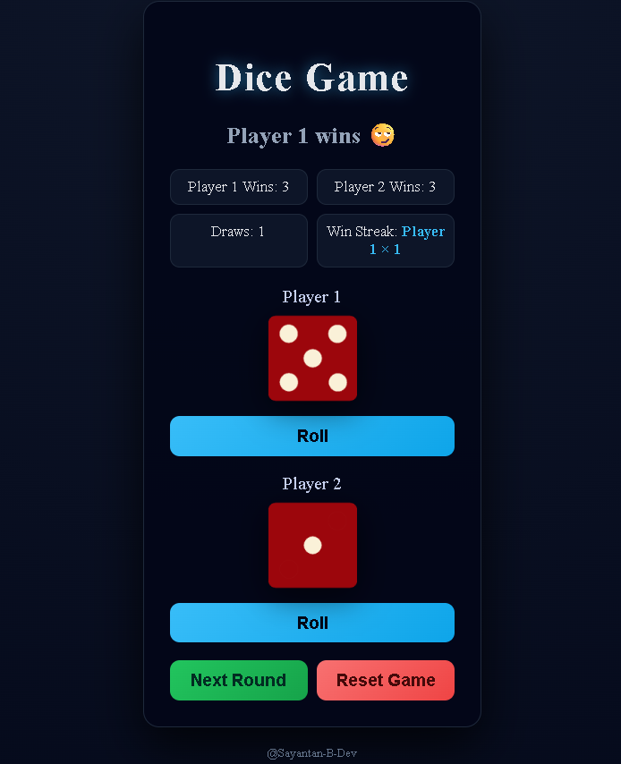

# Dice Game – Two Players

A modern, interactive two-player dice game built with **HTML, CSS, and Vanilla JavaScript**.  
Players roll independently, results are animated, and game statistics are tracked in real time without refreshing the page.

This project focuses on **state management, animations, clean UI design, and user experience**, making it suitable as both a learning project and a portfolio piece.

---

## What This Game Does

- Each player rolls their dice independently
- Dice visibly **spin before landing**
- Results are calculated only after both players roll
- Game state persists across rounds until reset

---

 
---

## Features

- Independent player turns
- Dice spin animation
- Win counter for each player
- Draw counter
- Win streak tracking
- Round reset (keep stats)
- Full game reset
- Button locking during animation (no double rolls)
- Responsive, modern dark UI
- No page refresh required

---

## Tech Stack

- HTML5  
- CSS3 (animations, gradients, responsive layout)  
- Vanilla JavaScript (no libraries, no frameworks)

---

## Game Rules

1. Player 1 clicks **Roll** to roll their dice
2. Player 2 clicks **Roll** to roll their dice
3. After both rolls:
   - Higher dice wins
   - Same number results in a draw
4. Win streaks update automatically
5. Click **Next Round** to continue
6. Click **Reset Game** to clear all stats

---

## How to Run

This is a fully static project.

### Option 1: Direct
1. Download or clone the repository
2. Keep all files and folders in the same structure
3. Open `index.html` in any modern browser

### Option 2: Local Server (recommended)
Use VS Code Live Server or any static server to avoid asset loading issues.

No installation, build step, or dependencies required.

---

## Learning Outcomes

- Managing shared game state
- Handling asynchronous animations
- Preventing race conditions in UI interactions
- DOM manipulation and event handling
- CSS keyframe animations
- Designing clean, user-friendly interfaces

---

## Notes

- Dice images must be located in `./images/` and named `dice1.png` to `dice6.png`
- Audio is intentionally not included to keep the logic focused
- Designed for learning and practice, but polished enough for showcase use

---

## Author

Created by Sayantan  
Practice project focused on JavaScript logic, UI state, and animations
